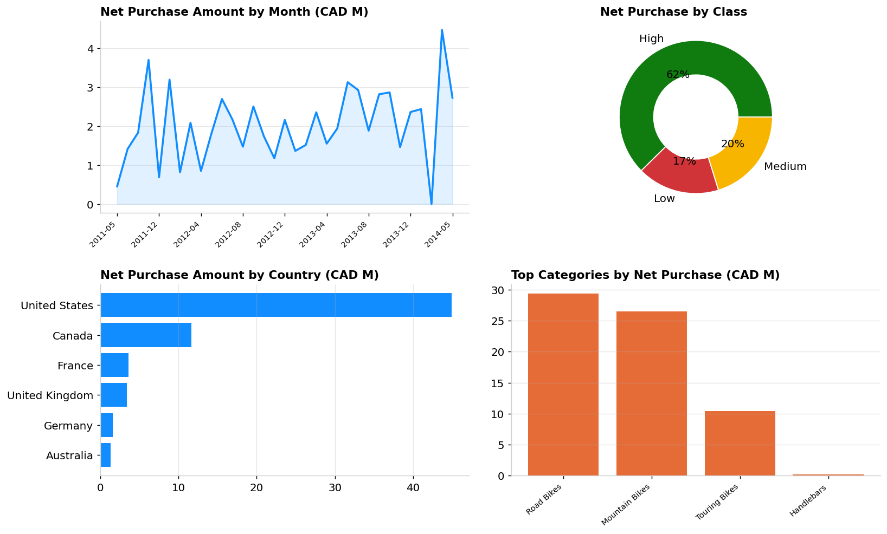

# City of Mainland — Procurement Analytics (Power BI)

End-to-end analytics project on the City of Mainland's global bicycle-parts procurement: raw Excel → cleaned star-schema model → SQL & DAX → an interactive Power BI dashboard with a Low/Medium/HIGH KPI.



## TL;DR

- **26,357** purchase transactions across **6 countries**, **104 products**, **37 categories**, **17 suppliers** (orders 2011–2014).
- **CAD 66.5M** total Net Purchase Amount (Purchased 67.0M − Discount 0.49M).
- Built a clean **star schema**, six **DAX measures**, and a parameterised **KPI band** straight from the brief.
- Delivered as a **Power BI Project (`.pbip`)** plus a reproducible **Python ETL** and standalone **SQL**.

## Key findings

| Insight | Detail |
|---|---|
| Demand is concentrated | The **United States** drives **CAD 44.9M** (~68% of net spend); Canada is second at 11.7M. |
| Premium mix dominates value | **High-class** products account for **CAD 41.5M** of net spend despite similar unit volumes to Low-class — value sits in the premium tier. |
| Two categories carry the book | **Road Bikes (29.4M)** and **Mountain Bikes (26.5M)** make up the large majority of net purchases. |
| Discounts are modest | Total discounts are **CAD 0.49M** (~0.7% of purchased value), concentrated in Mountain and Touring Bikes. |

## What's in the repo

```
.
├── data/
│   ├── raw/                  Original brief (PDF) + source workbook (.xls)
│   └── processed/            Cleaned CSVs + combined Excel model
├── scripts/
│   └── etl.py                Reproducible cleaning + modelling pipeline
├── sql/
│   └── queries.sql           The four required analytical queries (T-SQL)
├── dax/
│   └── measures.dax          All measures + the Low/Medium/HIGH KPI
├── powerbi/
│   ├── Mainland_Procurement.pbip           Open this in Power BI Desktop
│   ├── Mainland_Procurement.SemanticModel/ Model: tables, relationships, measures (TMDL)
│   └── Mainland_Procurement.Report/        4-page report (PBIR)
├── dashboard/
│   └── index.html            Self-contained interactive dashboard (no Power BI needed)
└── docs/
    ├── DATA_DICTIONARY.md
    └── images/
```

## Reproduce the analysis

```bash
pip install -r requirements.txt
python scripts/etl.py        # regenerates data/processed/* from data/raw/
```

The ETL reads the raw workbook, cleans it (missing `Color` → `Not Specified`, missing `PostalCode` → `Unknown`, typed dates, trimmed text), derives the brief's calculation fields, runs integrity assertions (unique keys, no orphan FKs, positive quantities/prices, zero residual nulls), and writes the processed model.

## Open the Power BI project

A `.pbix` is a proprietary binary that only Power BI Desktop can author, so the model and report ship as a **Power BI Project (`.pbip`)** — Microsoft's documented file format. To build the `.pbix`:

1. In Power BI Desktop: **Options → Preview features → enable "Power BI Project (.pbip) save option"**, then restart.
2. Open `powerbi/Mainland_Procurement.pbip`.
3. **Transform data → Edit parameters** → set **DataFolder** to the absolute path of `data/processed/` (with a trailing slash, e.g. `C:\...\data\processed\`).
4. **Refresh**, then **Save As → .pbix**.

See [`powerbi/README.md`](powerbi/README.md) for full details.

## Methodology

The calculation logic follows the project brief exactly:

```
Purchased Amount    = UnitPrice × OrderQty
Discount Amount     = UnitPriceDiscount × Purchased Amount
Net Purchase Amount = Purchased Amount − Discount Amount
```

KPI band on Net Purchase Amount (CAD): **< 10K → Low**, **10K–20K → Medium**, **> 20K → HIGH**. Implemented in DAX with `SWITCH`, so it re-evaluates at whatever grain a visual is filtered to.

## Report pages

1. **Executive Overview** — KPI cards, Net-by-Month trend, Net-by-Class, Net-by-Country, Net-by-Category, slicers.
2. **Top 10 by Country** — top products by quantity with a product-detail drill-down.
3. **Supplier Discounts** — supplier × category matrix filtered by Product Category.
4. **Geographic & Class** — map drill (Country → State → City) with a geographic detail table.

## Tech

Python (pandas) · SQL (T-SQL) · DAX · Power BI (PBIP / TMDL)

## Data note

The dataset is a teaching/sample dataset modelled on the AdventureWorks schema, used here for analytics demonstration. Amounts are in CAD per the brief.

## License

[MIT](LICENSE)
